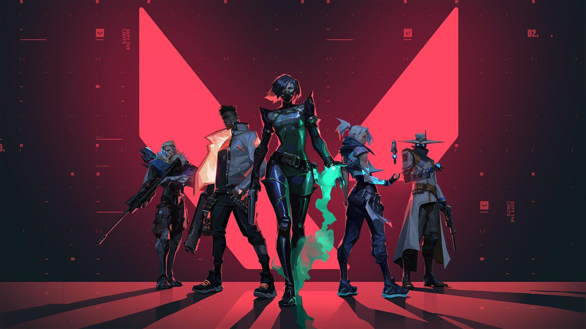
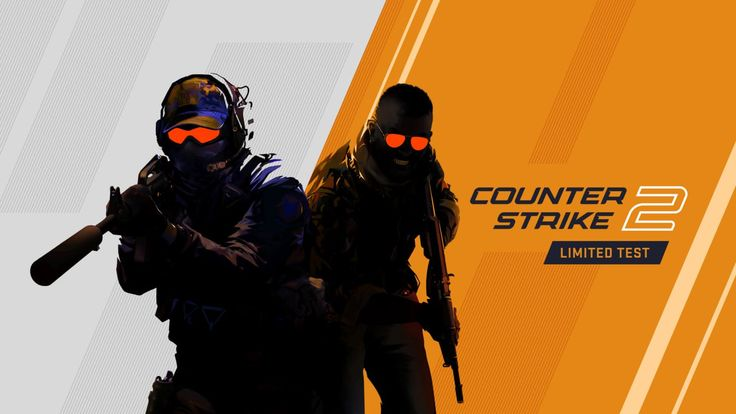
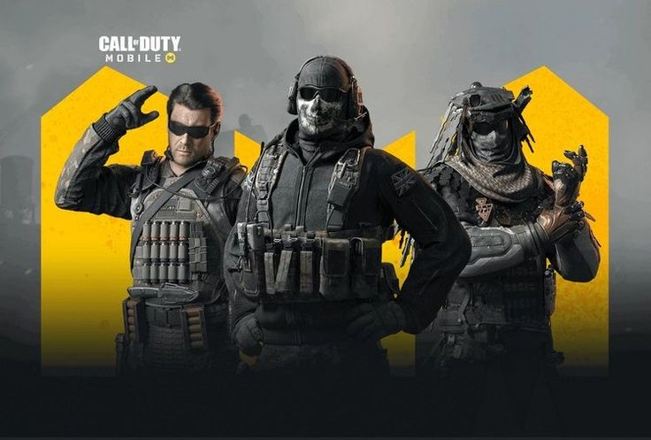

# PixelForge

PixelForge is a modern esports and media website showcasing featured games, live events, and partner brands. 

## Features
- Hero section with background video
- Featured games section with hover effect
- Watch live events
- Partners/Brands showcase

## Demo
Watch the website live here: [PixelForge Live](https://saikatmallick00.github.io/PixelForge/)

## Assets
- All images and videos are stored in `/assets` folder
- CSS is in `style.css`

## How to Run
1. Clone this repo
2. Open `index.html` in browser

## Screenshots / Video Demo

*(Optional: Video Demo can be added here as GIF or link)*

